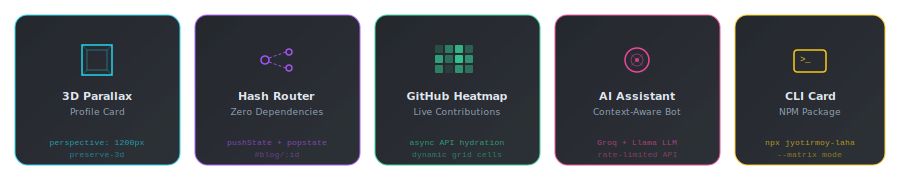
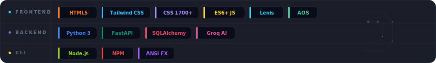

<!-- ═══════════════════════════════════════════════════════════════════ -->
<!-- ✨ ANIMATED HEADER BANNER — 3D wireframe sphere + floating cubes  -->
<!-- ═══════════════════════════════════════════════════════════════════ -->

<p align="center">
  
</p>

<!-- Badges Row -->
<p align="center">
  <a href="https://jyotirmoy-portfolio.onrender.com"></a>
  <a href="https://www.npmjs.com/package/jyotirmoy-laha"></a>
  <a href="https://www.linkedin.com/in/jyotirmoylaha2005/"></a>
  <a href="mailto:jyotirmoylaha@gmail.com"></a>
</p>

<p align="center">
  
  
  
</p>

<!-- ═══════════════════════════════════════════════════════════════════ -->
<p align="center"></p>
<!-- ═══════════════════════════════════════════════════════════════════ -->

##  &nbsp;About

> A **high-performance, single-page developer portfolio** featuring an integrated blog engine, a live GitHub contribution heatmap, and an AI-powered chatbot assistant — built with clean, modern web practices optimized for speed, rendering fidelity, and full responsiveness.

<br/>

<!-- ═══════════════════════════════════════════════════════════════════ -->
<!-- 🏗️ ANIMATED ARCHITECTURE DIAGRAM                                   -->
<!-- ═══════════════════════════════════════════════════════════════════ -->

##  &nbsp;Architecture

<p align="center">
  
</p>

<details>
<summary>📂 <b>Directory Structure</b></summary>
<br/>

```
j.portfolio.github/
│
├── 📄 index.html                 ← SPA entry point
├── 🎨 styles.css                 ← 1,700+ lines of custom CSS
├── ⚡ script.js                  ← Core DOM logic & interactivity
├── 📝 blog-posts.js              ← Static blog database
│
├── 💻 cli-card/                  ← Node.js CLI business card (NPM)
│   └── bin/index.js
│
└── 🤖 portfolio-chatbot/
    ├── frontend/                 ← Chatbot UI components
    └── backend/                  ← FastAPI + Groq LLM engine
        ├── main.py
        ├── requirements.txt
        └── .env
```

</details>

<br/>

<p align="center"></p>

<!-- ═══════════════════════════════════════════════════════════════════ -->
<!-- ✨ ANIMATED FEATURE CARDS                                          -->
<!-- ═══════════════════════════════════════════════════════════════════ -->

##  &nbsp;Core Features

<p align="center">
  
</p>

<br/>

<table>
  <tr>
    <td width="50%">

### 🖼️ Interactive 3D Parallax Card

- CSS 3D perspective context (`perspective: 1200px`)
- Real-time cursor tracking with dynamic rotation (max 12°)
- Parallax floating corners at `translateZ(35px)`
- Specular gloss overlay with `--sheen-x/y` CSS vars
- Gentle float animation, auto-disabled on hover

</td>
<td width="50%">

### 🛣️ Vanilla JS Hash Router

- Zero-dependency client-side routing
- `history.pushState` + `popstate` navigation
- Deep-linkable blog posts via `#blog/:id`
- Scroll position preservation across transitions
- No framework overhead — pure ES6+

</td>
  </tr>
  <tr>
    <td width="50%">

### 📊 Live GitHub Contribution Heatmap

- Async hydration from GitHub metrics API
- Dynamic grid with 5-level opacity states
- Viewport-aware tooltip integration
- Lazy-loaded on section visibility
- Real-time contribution data

</td>
<td width="50%">

### 🤖 Context-Aware AI Chatbot

- FastAPI backend with `BeautifulSoup4` scraper
- Groq SDK + Llama model for instant inference
- Auto-generates context vectors from live content
- CORS + sliding window rate limiting (20 req/hr/IP)
- Fully self-contained deployment

</td>
  </tr>
</table>

<br/>

<details>
<summary>💻 <b>Interactive CLI Business Card</b> — <code>npx jyotirmoy-laha</code></summary>
<br/>

```bash
# 🚀 Run it instantly — no install needed!
npx jyotirmoy-laha

# ✨ With the Matrix rain startup effect:
npx jyotirmoy-laha --matrix
```

| Feature | Details |
|---|---|
| **Zero Dependencies** | Pure Node.js `readline` + ANSI escape codes |
| **Interactive Navigation** | Arrow-key & numeric menu selection |
| **Cross-Platform** | Auto-detects OS for link launching |
| **Dripping Laser FX** | Custom animated terminal intro sequence |
| **Matrix Rain** | 3-second Matrix digital rain with `--matrix` flag |

</details>

<br/>

<p align="center"></p>

<!-- ═══════════════════════════════════════════════════════════════════ -->
<!-- 💻 ANIMATED TECH STACK                                             -->
<!-- ═══════════════════════════════════════════════════════════════════ -->

##  &nbsp;Tech Stack

<p align="center">
  
</p>

<br/>

<table>
  <tr>
    <th align="center">Layer</th>
    <th align="center">Technologies</th>
  </tr>
  <tr>
    <td align="center"><b>🎨 Frontend</b></td>
    <td>
      
      
      
      
      
      
    </td>
  </tr>
  <tr>
    <td align="center"><b>⚙️ Backend</b></td>
    <td>
      
      
      
      
      
    </td>
  </tr>
  <tr>
    <td align="center"><b>💻 CLI</b></td>
    <td>
      
      
      
    </td>
  </tr>
</table>

<br/>

<p align="center"></p>

<!-- ═══════════════════════════════════════════════════════════════════ -->
<!-- ⚙️ GETTING STARTED                                                 -->
<!-- ═══════════════════════════════════════════════════════════════════ -->

##  &nbsp;Getting Started

<details open>
<summary><b>1️⃣ Frontend — Static Server</b></summary>
<br/>

```bash
# Clone the repository
git clone https://github.com/JyotirmoyLaha/j.portfolio.github.git
cd j.portfolio.github

# Serve with Python
python -m http.server 5500
```

> 🌐 Open **`http://localhost:5500`** in your browser

</details>

<details>
<summary><b>2️⃣ Chatbot Backend — FastAPI</b></summary>
<br/>

```bash
cd portfolio-chatbot/backend

# Create virtual environment
python -m venv .venv

# Activate (Windows)
.venv\Scripts\activate

# Install dependencies
pip install -r requirements.txt
```

Create a **`.env`** file inside `portfolio-chatbot/backend/`:

```env
GROQ_API_KEY=your_groq_api_key
PORTFOLIO_URL=http://localhost:5500
ALLOWED_ORIGIN=http://localhost:5500
```

> [!IMPORTANT]
> The chatbot backend relies on `GROQ_API_KEY` for AI completions. Get your free key at [console.groq.com](https://console.groq.com).

```bash
# Start the FastAPI server
uvicorn main:app --reload --port 8000
```

</details>

<details>
<summary><b>3️⃣ CLI Business Card — Node.js</b></summary>
<br/>

```bash
cd cli-card

# Link for local testing
npm link
jyotirmoy-laha

# Or run directly
node bin/index.js

# With Matrix rain effect ✨
node bin/index.js --matrix
```

> [!TIP]
> Linking with `npm link` lets you test the `jyotirmoy-laha` command globally before publishing.

</details>

<br/>

<p align="center"></p>

<!-- ═══════════════════════════════════════════════════════════════════ -->
<!-- 🌐 DEPLOYMENT                                                      -->
<!-- ═══════════════════════════════════════════════════════════════════ -->

##  &nbsp;Deployment

<table>
  <tr>
    <th>Component</th>
    <th>Platform</th>
    <th>Configuration</th>
  </tr>
  <tr>
    <td>🌐 <b>Frontend</b></td>
    <td> </td>
    <td>Ensure all paths are relative</td>
  </tr>
  <tr>
    <td>🤖 <b>Chatbot API</b></td>
    <td></td>
    <td>Set <code>ALLOWED_ORIGIN</code> for production CORS</td>
  </tr>
  <tr>
    <td>💻 <b>CLI Package</b></td>
    <td></td>
    <td>Published as <code>jyotirmoy-laha</code></td>
  </tr>
</table>

<br/>

<p align="center"></p>

<!-- ═══════════════════════════════════════════════════════════════════ -->
<!-- 📊 GITHUB STATS                                                    -->
<!-- ═══════════════════════════════════════════════════════════════════ -->

##  &nbsp;GitHub Stats

<p align="center">
  
  &nbsp;&nbsp;
  
</p>

<p align="center">
  
</p>

<p align="center">
  
</p>


<p align="center"></p>

<!-- ═══════════════════════════════════════════════════════════════════ -->
<!-- ANIMATED FOOTER                                                    -->
<!-- ═══════════════════════════════════════════════════════════════════ -->

<p align="center">
  
</p>

<p align="center">
  <a href="https://jyotirmoy-portfolio.onrender.com">
    
  </a>
</p>

<p align="center">
  <sub>⭐ Star this repo if you found it interesting!</sub>
</p>
