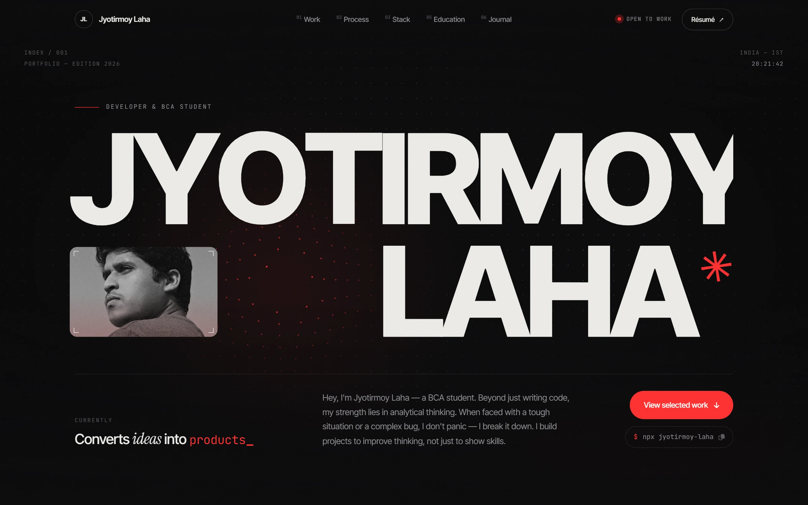

<!--
  ┌──────────────────────────────────────────────────────────────┐
  │  JYOTIRMOY LAHA — PORTFOLIO                                    │
  │  Noir editorial system · one signal red · zero chill           │
  └──────────────────────────────────────────────────────────────┘
-->

<p align="center">
  <a href="https://jyotirmoy-portfolio.onrender.com">
    
  </a>
</p>

<p align="center">
  <a href="https://jyotirmoy-portfolio.onrender.com"></a>
  <a href="https://www.npmjs.com/package/jyotirmoy-laha"></a>
  <a href="https://www.linkedin.com/in/jyotirmoylaha2005/"></a>
  <a href="mailto:jyotirmoy713128@gmail.com"></a>
</p>

<p align="center">
  
  
  
  
</p>

<br/>

<p align="center">
  <sub><code>INDEX / 001</code> &nbsp;·&nbsp; <code>STATUS ● OPEN TO WORK</code> &nbsp;·&nbsp; <code>LOCAL TIME — IST</code></sub>
</p>

<p align="center"></p>

## `(00)` &nbsp;The brief

> *"Make it formal. Make it polished. Make it so their jaw hits the floor."*

So it got built like a film title sequence instead of a template. Near-black canvas. Hairline grid. One signal red, used like a warning light. Type so big it has to be clipped. Every pixel either earns its place or leaves.

<table>
  <tr>
    <td width="33%" valign="top">
      <b>Formal</b><br/>
      <sub>Numbered sections <code>(01)–(07)</code>, editorial grid, Inter Tight × Instrument Serif × JetBrains Mono.</sub>
    </td>
    <td width="33%" valign="top">
      <b>Polished</b><br/>
      <sub>Lenis smooth scroll, masked reveals, magnetic buttons, a cursor that knows what it's hovering.</sub>
    </td>
    <td width="33%" valign="top">
      <b>Unsettling</b><br/>
      <sub>Letters that flinch away from your cursor. A name that glitches when you're not looking.</sub>
    </td>
  </tr>
</table>

<p align="center"></p>

## `(01)` &nbsp;Exhibit A

<p align="center">
  <a href="https://jyotirmoy-portfolio.onrender.com">
    
  </a>
  <br/>
  <sub>↑ the actual hero. Not a mockup. Move your mouse over it on the live site and watch the dots run.</sub>
</p>

<p align="center"></p>

## `(02)` &nbsp;What happens when you open it

```text
t = 0.0s   ███  black. a counter starts: 000 → 100. status: Initializing → Loading assets → Compiling → Ready
t = 2.6s   ▀▀▀  a red hairline flashes across the middle. the screen tears open — top half up, bottom half down
t = 3.0s   J Y O T I R M O Y   letters rise one by one out of a mask
t = 3.5s   ▣    the portrait wipes in, black & white, crop marks in the corners
t = 4.0s   ✳    the asterisk starts spinning. the IST clock starts ticking. the role line begins to scramble
t = ∞      ░░░  every 5–11 seconds the name glitches — red/cyan split, three frames, gone
```

<table>
  <tr>
    <td width="50%" valign="top">

### ◼ The Hero
- **Repelling dot field** — a canvas grid of 1,500+ points with spring physics; points scatter from your cursor and burn red as you get close
- **Flinching letters** — each glyph of the name is pushed away from the pointer and turns red at close range
- **Chromatic glitch** — `::before` / `::after` layers with clipped red/cyan offsets, on hover and on a random timer
- **Text scramble** — "Converts *ideas* into `code` → `products` → `AI tools` → `systems` → `experiences`"
- **Live HUD** — edition year + India Standard Time clock

</td>
    <td width="50%" valign="top">

### ◼ The Feel
- **Custom cursor** — dot + lagging ring; grows on links, becomes a red **VIEW** disc over project shots, steps aside for the native cursor in text fields and the chatbot
- **Magnetic buttons** — CTAs lean toward the pointer
- **Masked reveals** — headings rise with blur + skew as they enter view
- **Scroll progress** — a 2px red line across the top of the page
- **Film grain** — animated SVG noise over everything, 7% opacity

</td>
  </tr>
  <tr>
    <td width="50%" valign="top">

### ◼ The Work
- Five projects, editorial rows: index · category · title · stack · links
- Screenshots sit at **90% grayscale** until hovered, then bleed into color
- A red rule sweeps across each row on hover

</td>
    <td width="50%" valign="top">

### ◼ The Receipts
- **Live GitHub heatmap**, re-colored in five shades of red, with a year switcher
- **Streak stats** — total contributions, current streak, longest streak
- **Count-up numbers** that only run when you scroll to them

</td>
  </tr>
  <tr>
    <td width="50%" valign="top">

### ◼ The Journal
- Built-in blog engine — posts live in `blog-posts.js`
- Hash routing: `#blog`, `#blog/:id`, real back/forward support
- Infinite marquee of entries on the home page

</td>
    <td width="50%" valign="top">

### ◼ The Assistant
- Floating chatbot answering questions about Jyotirmoy
- **FastAPI + Groq** (`openai/gpt-oss-120b` by default) reading the live site for context
- 20 requests / hour / visitor, 300 / hour overall, CORS-locked

</td>
  </tr>
</table>

<p align="center"></p>

## `(03)` &nbsp;Selected work

| `#` | Project | What it is | Stack | |
|:--:|---|---|---|---|
| `01` | **Portfolio Website** | This thing. Splash, blog engine, smooth-scroll, built from scratch | HTML · CSS · JS | [live](https://jyotirmoy-portfolio.onrender.com/) · [src](https://github.com/JyotirmoyLaha/j.portfolio) |
| `02` | **J.SkyCast** | Real-time weather dashboard on the OpenWeatherMap API | JS · API · Tailwind | [live](https://j-weather.onrender.com) · [src](https://github.com/JyotirmoyLaha/j.weather) |
| `03` | **AI Resume Analyzer** | NLP resume parsing + scoring against job descriptions | Python · FastAPI · NLP | [live](https://ai-resume-analyzer-hhhb.onrender.com/) · [fe](https://github.com/JyotirmoyLaha/ai_resume_analyzer_frontend) · [be](https://github.com/JyotirmoyLaha/ai-resume-analyzer-backend) |
| `04` | **Mess Manager** | Hostel expense splitting with Firebase + Google Auth + PDF reports | JS · Firebase | [live](https://mess-maneger.onrender.com/) · [src](https://github.com/JyotirmoyLaha/mess-maneger) |
| `05` | **StudyVerse** | Zen journal with Google SSO and real-time sync | JS · Firebase | [live](https://studyverse-vlzh.onrender.com/) · [src](https://github.com/JyotirmoyLaha/studyverse) |

<p align="center"></p>

## `(04)` &nbsp;No website? Use the terminal.

<p align="center">
  
</p>

```bash
npx jyotirmoy-laha
```

A business card that lives in your shell. Matrix rain → dripping logo → laser line → an arrow-key menu (About · Skills · Projects · Socials · Open Web Portfolio). Pure Node.js `readline` + ANSI escapes, no dependencies.

<p align="center"></p>

## `(05)` &nbsp;Under the hood

```text
             ┌─────────────────────────────── browser ───────────────────────────────┐
             │                                                                        │
 index.html ─┤  styles.css   design tokens · noir palette · reveal system · layout    │
             │  script.js    preloader · Lenis · router · heatmap · canvas field      │
             │               split letters · scramble · cursor · magnetic · reveals   │
             │  blog-posts.js   the journal's database                                │
             │  chatbot.js  ──────── fetch ────────┐                                  │
             └─────────────────────────────────────┼──────────────────────────────────┘
                                                   ▼
                              portfolio-chatbot/backend  (FastAPI)
                              scrape live site ─► context ─► Groq LLM ─► answer
```

<table>
  <tr><th align="left">Layer</th><th align="left">Tech</th></tr>
  <tr>
    <td><b>Page</b></td>
    <td>
      
      
      
      
      
      
    </td>
  </tr>
  <tr>
    <td><b>Tooling</b></td>
    <td>
      
      
      
    </td>
  </tr>
  <tr>
    <td><b>Assistant</b></td>
    <td>
      
      
      
      
    </td>
  </tr>
  <tr>
    <td><b>Type</b></td>
    <td><sub><b>Inter Tight</b> (display) · <i>Instrument Serif</i> (the italics) · <code>JetBrains Mono</code> (labels, HUD)</sub></td>
  </tr>
  <tr>
    <td><b>Palette</b></td>
    <td><code>#060607</code> canvas · <code>#ecebe7</code> ink · <code>#8d8c92</code> muted · <code>#ff2d2d</code> <b>signal</b></td>
  </tr>
</table>

<details>
<summary><b>📂 Directory map</b></summary>
<br/>

```text
j.portfolio.github/
├── index.html              ← the whole site: preloader, hero, sections, journal, footer
├── styles.css              ← noir design system (tokens → components → motion)
├── script.js               ← all behaviour, no framework
├── blog-posts.js           ← journal entries
├── Jyotirmoy_Laha_Resume.pdf
├── images/
│   ├── readme/             ← animated SVGs for this README
│   └── *.webp              ← project shots, portrait, blog covers
├── portfolio-chatbot/
│   ├── frontend/           ← chat widget (chatbot.js / chatbot.css)
│   └── backend/            ← FastAPI + Groq (main.py, requirements.txt, .env.example)
├── cli-card/               ← the `npx jyotirmoy-laha` package
├── src/                    ← React + Spline experiments (not mounted by index.html)
├── vite.config.ts · tsconfig.json · package.json
└── postbuild.cjs           ← copies static assets into dist/ after the Vite build
```

</details>

<p align="center"></p>

## `(06)` &nbsp;Run it yourself

<details open>
<summary><b>Site</b></summary>
<br/>

```bash
git clone https://github.com/JyotirmoyLaha/j.portfolio.github.git
cd j.portfolio.github
npm install
npm run dev          # → http://localhost:5173
```

```bash
npm run build        # tsc → vite build → postbuild.cjs copies static assets into dist/
```

</details>

<details>
<summary><b>Chatbot backend</b></summary>
<br/>

```bash
cd portfolio-chatbot/backend
python -m venv .venv
.venv\Scripts\activate            # macOS/Linux: source .venv/bin/activate
pip install -r requirements.txt
```

Create `portfolio-chatbot/backend/.env` (see `.env.example`):

```env
GROQ_API_KEY=your_groq_api_key
PORTFOLIO_URL=http://localhost:5173
ALLOWED_ORIGIN=http://localhost:5173
# optional — defaults to openai/gpt-oss-120b
GROQ_MODEL=openai/gpt-oss-120b
```

```bash
uvicorn main:app --reload --port 8000
```

> [!IMPORTANT]
> Get a free key at [console.groq.com](https://console.groq.com). The API allows 20 requests per hour per visitor and 300 per hour in total (`GLOBAL_RATE_LIMIT`).

</details>

<details>
<summary><b>CLI card</b></summary>
<br/>

```bash
cd cli-card
node bin/index.js     # or: npm link && jyotirmoy-laha
```

</details>

<p align="center"></p>

## `(07)` &nbsp;Accessibility, because scary ≠ hostile

- `prefers-reduced-motion` freezes the dot field, stops the glitch, scramble and grain, and shows every reveal instantly
- The custom cursor only exists on fine pointers. Touch devices never see it, and text fields always keep the native I-beam
- Skip-to-content link, visible `:focus-visible` rings, keyboard-operable journal cards and copy button
- No horizontal scroll at 390px. The hero name scales to fit the viewport

### Security

- **Content-Security-Policy** in `index.html`: no inline scripts or handlers, only the hosts the page really uses. Every click goes through one delegated listener (`data-action`)
- **Subresource Integrity** on the CDN files (Lenis, Font Awesome)
- **Escaped rendering**: blog posts and chatbot replies are HTML-escaped; chatbot links only allow `http(s):` and `mailto:`
- **Chatbot API**: page text is sent as fenced, untrusted user data (never system instructions), body capped at 16 KB, per-visitor + global rate limits keyed on Cloudflare's `CF-Connecting-IP`, non-blocking Groq calls

> [!IMPORTANT]
> Two protections only work as real HTTP response headers, not `<meta>` tags. On Render: **Static Site → Settings → Headers**, path `/*`:
>
> | Header | Value |
> |---|---|
> | `X-Frame-Options` | `DENY` |
> | `Content-Security-Policy` | `frame-ancestors 'none'` |

<p align="center"></p>

<p align="center">
  
</p>

<p align="center">
  <a href="https://jyotirmoy-portfolio.onrender.com"></a>
</p>
